  

## 📌 About Me
- 🔭 I’m currently working on InterviewMate - A AI Powered Interview Prep Ecosystem
- 🌱 I’m currently learning microservice , spring boot , devops (docker, k8s) , AWS
- 🤝 I’m looking for help with InterviewMate
- 📝 I regularly write articles on [my heart "hahahah..!"]
- 💬 Ask me about nothing
- 📫 How to reach me arindampal669@gmail.com
- 📄 Know about my experiences [find it from portfolio]
- ⚡ Fun fact nothing is fun, be serious

## 🧠 My Focus Areas
- Cloud Technologies
- Backend Development
- Automation
- AI/ML
- Micro Service

## 📊 GitHub Stats & Trophies

  
  

  

  

## 🛠️ Languages & Tools

<h3 align="center">Programming Languages</h3>

  &nbsp;&nbsp;&nbsp;&nbsp;&nbsp;
  &nbsp;&nbsp;&nbsp;&nbsp;&nbsp;
  

<h3 align="center">Backend</h3>

  &nbsp;&nbsp;&nbsp;&nbsp;&nbsp;
  

<h3 align="center">Database</h3>

  &nbsp;&nbsp;&nbsp;&nbsp;&nbsp;
  &nbsp;&nbsp;&nbsp;&nbsp;&nbsp;
  &nbsp;&nbsp;&nbsp;&nbsp;&nbsp;
  

<h3 align="center">DevOps & Cloud</h3>

  &nbsp;&nbsp;&nbsp;&nbsp;&nbsp;
  &nbsp;&nbsp;&nbsp;&nbsp;&nbsp;
  &nbsp;&nbsp;&nbsp;&nbsp;&nbsp;
  

<h3 align="center">Tools</h3>

  &nbsp;&nbsp;&nbsp;&nbsp;&nbsp;
  &nbsp;&nbsp;&nbsp;&nbsp;&nbsp;
  

  

 

## 🔗 Connect with Me

  &nbsp;&nbsp;&nbsp;&nbsp;
  &nbsp;&nbsp;&nbsp;&nbsp;
  &nbsp;&nbsp;&nbsp;&nbsp;
  

  

  

